# CORP-ENV: Shared Workspace Governance for Corporate Planning Agents


[](https://github.com/meta-pytorch/OpenEnv)
[](https://opensource.org/licenses/MIT)

---

## 🎯 The Story: Why We Built the Enterprise Mess

Frontier models excel at coding but fail spectacularly at **long-horizon corporate planning**. As highlighted by [ServiceNow's EnterpriseOps-Gym](https://enterpriseops-gym.github.io/), top models hit only ~37% success in enterprise settings. Throw an LLM into a multi-department dispute over budgets and headcount, and it structurally collapses—losing state and finalizing prematurely. 

Current agents lack the strategic reasoning necessary for autonomous deployment. Until CORP-ENV, there was no environment demanding that agents maintain a structured state of complex, contradictory human dynamics. We built an ambitious, deterministic environment where models can be meaningfully trained to untangle the corporate mess, moving beyond flaky vibes to rigorous state tracking. 

---

## 🏗️ Environment Innovation: The Shared Workspace Document (SWD)

The core innovation of CORP-ENV is the **SWD (Shared Workspace Document)**. 

Agents aren't just typing chit-chat to one another. The Master Agent acts as a PM, CFO, or CEO and must issue **RFC 6902 JSON Patches** to mutate a rigid JSON workspace document. 



### The SWD Structure Shape

The document is a rigorous JSON schema defining the exact state of the enterprise episode. This is the central source of truth the agent must maintain:

```json
{
  "episode_id": "uuid",
  "scenario": "description of the problem",
  "phase": "discovery | analysis | decision | execution",
  "milestones": [
    {
      "id": "str",
      "label": "str",
      "due_by_turn": 10,
      "status": "pending",
      "owner": "agent_id",
      "output": null
    }
  ],
  "agent_reports": {
    "qa": null, /* string payload from worker agents */
    "dev": null,
    "hr": null,
    "finance": null
  },
  "decisions": [],
  "conflicts_identified": [],
  "conflict_resolutions": [],
  "reasoning_log": [],
  "final_recommendation": null,
  "swd_version": 0
}
```

### The Reality of Corporate Planning:
- The agent must **delegate** to worker stubs (`dev_agent`, `hr_agent`, `finance_agent`).
- It has to parse their conflicting reports.
- It must **log conflicts** and structure its **reasoning** within the SWD.
- By enforcing `CORP_STUB_WORKERS=1` and `CORP_DISABLE_LLM_JUDGE=1`, we create an environment that is brutally challenging, strictly deterministic, and fully reproducible.

---

## 🏆 A Reward Signal That Actually Teaches

A great environment relies on a reward function that provides rich signals, not just an arbitrary 0 or 1 at the end of the tunnel. In CORP-ENV, if an agent just blindly guesses the final outcome without doing the work, it fails. The reward is meticulously designed:

- **Rich, Informative, and Composable**: We use OpenEnv's Rubric system. The reward blends Phase Transitions, Conflict Identification, Resolution Logging, and Iterative Validation. It's a composable rubric scoring far beyond monolithic `success/failure`.
- **Captures Something Hard**: It captures *how well* the model organizes chaos. The structure of the SWD and the presence of documented reasoning phases provide dense intermediate signals.
- **Hard to Game**: An agent attempting to exploit the reward by skipping to `finalize` gets severely penalized. If it missed milestones, didn't talk to HR, or submitted malformed JSON patches, the reward is aggressively clamped. 

We explicitly removed any reliance on ambiguous LLM judges. Our rewards are pure, programmatic validations of corporate rigor.

---

## 📈 Observable Evidence: Showing Real Improvement

We don't just have an environment—we have the training loop to prove it works. 

We ran a robust training pipeline starting with Base → SFT → RLVR on the **Qwen 2.5-7B** instructing model. 
*Note: All Qwen 2.5-7B deep runs were performed on H100 servers using the robust scripts in `training/`, with logs available at `training_logs/`. (We also provide a Colab-friendly T4 `notebooks/training.ipynb` that leverages Qwen 2.5 3B Instruct to respect memory limitations!)*

Here are the observable, before-and-after results illustrating massive agent improvement across shifting corporate complexities:

| Model Stage | E1 Launch Rwd | M1 Budget Rwd | H1 Acquisition Rwd | M1 Success |
| --- | --- | --- | --- | --- |
| Base (Qwen 2.5-7B) | 0.910 | 0.707 | 0.761 | 0% |
| **SFT** | **0.910** | **0.943** | **0.882** | **100%** |
| **RLVR** | **0.910** | **0.932** | **0.779** | **80%** |


### Why RLVR Beats GRPO: The Power of Verifiable Rewards
During our training loop iterations, we found that traditional GRPO fundamentally struggles with sparse, multi-step constraints. Because most intermediate rollouts in complex corporate trajectories receive extreme penalties for missing milestones or creating invalid SWD schemas, they exhibit zero reward variance inside the batch. This means GRPO's advantage estimations collapse—it cannot learn a useful gradient from a batch of uniformly failed trajectories.

By using RLVR (Rejection-Sampling Fine-Tuning) backed by strict verifiable rewards, we only update the model on completions that actually achieve a non-zero, robustly validated state. This method drops the noise and guarantees that verifiable progress dictates model weight updates.


### Before Training: The Clueless Executive
Untrained models panic. They invoke `delegate` once, maybe twice, skip logging the conflicts, and instantly `finalize`. Result? A pathetic **0% success rate on the M1 Budget Reallocation task**. 

### After Training (SFT + RLVR): The Competent Leader
Post-training, the agent queries the `dev` team, parses their resource demands, pings `hr` about headcount impact, utilizes the `query_swd` to check the current SWD phase, applies a beautifully formatted `update_swd` JSON patch resolving the conflict, and correctly finalizes. Result? The reward skyrockets, hitting **100% success on M1 post-SFT**.

---

## ⚙️ Pipeline Setup: End-to-End Reliability

We set up a robust, replicable, and highly coherent pipeline. 

Using Rejection-Sampling Fine-Tuning (RLVR), our pipeline guarantees that only the actions genuinely improving our dense rubric make it back into the model's weights. 

By leveraging **deterministic** stubs (`CORP_STUB_WORKERS=1`), we effectively created a chaotic yet governable micro-universe where small language models can learn how to master enterprise decision-making. We show that complex, layered corporate planning can be systematically untangled and conquered.
